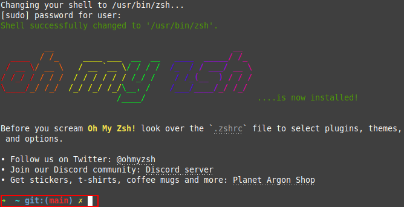
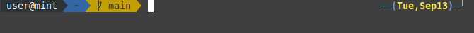

# How to Install and Configure Z Shell in Ubuntu Linux

Z Shell (zsh) is a popular alternative to the default command line bash shell due to its improved features like recursive path expansion, automatic spelling correction, and plug-in and theme support. 

This guide will walk you through the process of installing and configuring zsh, including how to change themes and enable the autosuggestions plug-in. 

## Before You Begin

Complete the following steps prior to getting started:

1. Install [Git](https://git-scm.com/):

```
sudo apt install curl wget git
```

## Installation

1. Install [Zsh](https://zsh.sourceforge.io/):
```
sudo apt install zsh
```

2. Install [Oh My Zsh](https://ohmyz.sh/):
```
sh -c "$(curl -fsSL https://raw.github.com/ohmyzsh/ohmyzsh/master/tools/install.sh)"
```

You should now see the following prompt asking if you'd like to change your defaut shell to zsh. Type `y` to confirm. 


Take a look at your command line and you'll notice the difference right away. 





If for any reason you need to switch back to the bash shell, use the following command: 
```
chsh -s $(which bash)
```
Proceed to log out and back into your session for the change to take effect.

Run `echo $SHELL` to confirm the output is `/bin/bash`



## Change Zsh Theme
By default, the theme is set to `robbyrussell`. However, this is rather plain and there are over 100+ included themes with a wide assortment of colors and styles to choose from. 

For example, here are 3 uniquely different themes to choose from:

1. jonathan


2. xiong-chiamiov


2. agnoster



Follow these steps to change themes to `jonathan`:

1. Open your zsh configuration file
```
vi ~/.zshrc
```
2. Press `i` to enter Insert Mode

3. Change the ending of the line reading
```
ZSH_THEME="robbyrussell"
```
to
```
ZSH_THEME="jonathan"
```

4. Press `ESC` to leave Insert Mode and enter Command Mode.

5. Press `:wq` + `ENTER` to save and quit.

6. Reload the command line:
```
source ~/.zshrc
```

7. Check out your newly themed command line and repeat steps 1-6 with a few more themes to find the best fit.

8. To see the full list of locally available zsh themes, follow these steps:

    a. `cd ~/.oh-my-zsh/themes`

    b. `ls`

## Enable Autosuggestions
The autosuggestions plug-in is quite possibly the single most time-saving tool when coding. Instead of having to type the same command over and over again in full, this plug-in automatically suggests the rest of your command as you are typing, without even having to press `TAB`. 

For example, instead of having to type `git push origin main` every single time you wish to push a new commit, you can instead type `git push` and the command line will automatically show a preview of the rest of the suggested command based on your shell's history.


Follow these steps to install and enable the autosuggestions plug-in:

1. Change directories to the oh-my-zsh plug-ins location:
```
cd ~/.oh-my-zsh/plugins/
```

2. Clone the autosuggestions plugin packages:
```
git clone https://github.com/zsh-users/zsh-autosuggestions.git $ZSH_CUSTOM/plugins/zsh-autosuggestions
```
3. Edit the zsh configuration file:

    a. `vi ~/.zshrc`

    b. Press `i` to enter Insert Mode

    c. Update the line beginning with `plugins=()` to
    `plugins=(git zsh-autosuggestions)`

    d. Press `:wq` + `ENTER` to save and quit. 

4. Reload the command line for the changes to take effect:
```
source ~/.zshrc
```

5. Try it out! Start typing a command you know to be in your shell's history and watch as zsh offers auto-complete suggestions. Press the right arrow key to accept a suggestion.

## More Information

You may wish to consult the following resources for additional information on this topic. While these are provided in the hope that they will be useful, please note that we cannot vouch for the accuracy or timeliness of externally hosted materials.

- [Official Zsh Documentation](https://zsh.sourceforge.io/Doc/)
- [Oh My Zsh Framework Documentation](https://github.com/ohmyzsh/ohmyzsh/wiki)
- [List of Zsh Themes](https://github.com/ohmyzsh/ohmyzsh/tree/master/themes)


