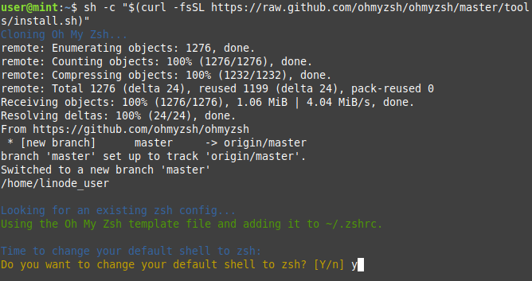

# How to Install and Configure Z Shell in Ubuntu

Z Shell (zsh) is a popular alternative to the default command line bash shell that offers several additional features like recursive path expansion, automatic spelling correction for mistyped directory names, and plugin and theme support. 

This guide will walk you through the process of installing and configuring zsh, including how to change themes as well as enable one of its most useful plugins, auto-complete suggestions. 

## Before You Begin

Prior to moving on, please complete the following steps:

### 1. Install [Git](https://git-scm.com/):

```
sudo apt install curl wget git
```

## Installation

### 1. Install [Zsh](https://zsh.sourceforge.io/):
```
sudo apt install zsh
```

### 2. Install [Oh My Zsh](https://ohmyz.sh/):
```
sh -c "$(curl -fsSL https://raw/github.com/ohmyzsh/ohmyzsh/master/tools/install.sh)"
```

You should see the following prompt asking if you'd like to set your defaut shell to zsh. Press `y` to confirm. 





If for any reason you need to switch back to the bash shell, use the following command and then log out and back into your session :
```
chsh -s $(which bash)
```


